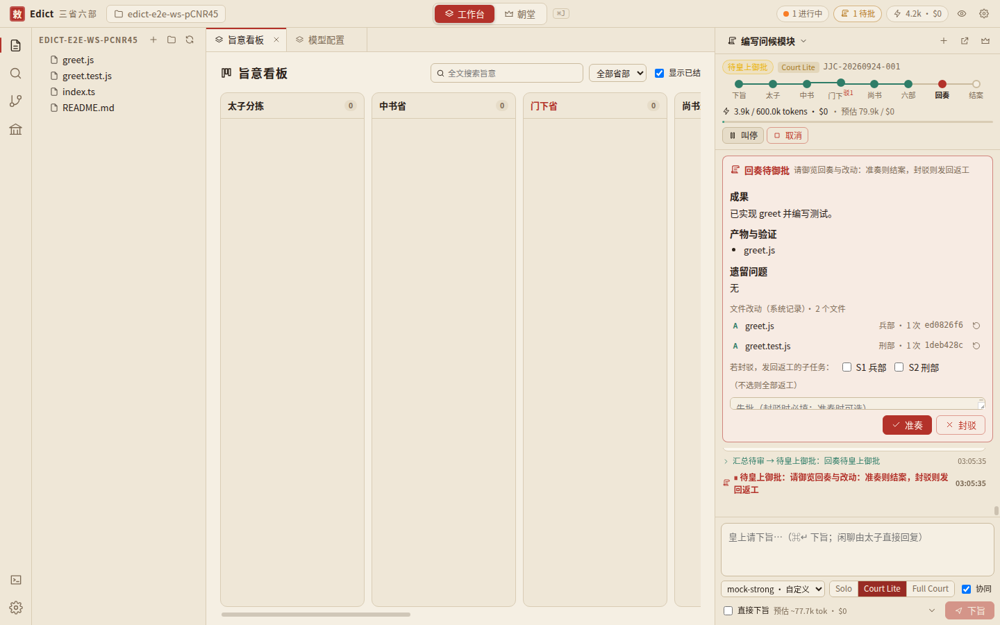

# Edict for Mac · 三省六部像素朝堂 AI 编程工作站

[English](README.md) | 中文

> 下载：[最新版本（Releases）](https://github.com/Logosss1/Edict_Court/releases/latest) · 旧的 0.x 桌面封装版本见 [历史 Releases](https://github.com/Logosss1/Edict_Court/releases) 与 `v0.3.2` 及更早的标签。

> 以 [Edict](https://github.com/cft0808/edict) 的三省六部多 Agent 协作为核心
> 构建的 macOS（**仅 Apple Silicon / arm64**）桌面 AI 编程工具。Web 技术构建界面（Electron + React + Monaco + xterm.js + Phaser 3），原生桌面应用形态交付。

```
皇上下旨 → 太子分拣（闲聊直答）→ 中书省规划 → 门下省审议（准奏 / 封驳，封驳强制返工）
        → 尚书省派发 → 六部并行执行 → 汇总回奏 → 皇上御批结案（奏折自动归档）
```

## 两种模式，同一个运行时（⌘J 切换）

| 工作台（默认） | 朝堂（像素 · 唐） |
|---|---|
|  |  |
| Cursor 式下旨输入框（⌘L 隐藏/显示）· 模型 / 三档 / 多 Agent 开关 · 实时活动流 · 准奏/封驳 · Editor | 皇上端坐龙椅；官员小人的动作 = Agent 实时状态；点击小人查看工作并朱批；奏折批阅浮层 |

- 两种模式只是**同一份运行时状态**（主进程）的两种投影：任务、审批、结果、审计完全一致、实时双向同步。
- 在朝堂里准奏，工作台立即结案；在工作台叫停，朝堂里的官员立即停笔。

## 协同三档

| 档位 | 流程 | 适用 |
|---|---|---|
| **Solo** | 独相直接对话、读写文件、执行命令，无编排 | 简单任务，最省 token |
| **Court Lite**（默认） | 太子分拣 → 中书规划 → 门下审议（封驳上限 1，超限升级御裁）→ 六部执行 → 回奏御批 | 日常任务 |
| **Full Court** | 太子 / 中书 / 门下 / 尚书 / 六部全流程；可选**朝堂议政**；**方案御览（可朱笔涂改）**；六部并行（依赖图）；门下**审议成果**；封驳循环（上限 3） | 复杂长任务 |

关闭「协同」开关 = Solo。

## 核心能力

- **制度性审核**：状态机与 Edict 的 `STATE_TRANSITIONS` 一致，中书 → 尚书之间**没有任何绕过门下省的路径**；非法流转被拒绝并写入审计；高风险流转（执行中取消、审议中取消、结案）必须由皇上亲自完成。
- **完全可观测**：每位官员的 thinking（流式）、工具调用与返回、日志、状态、错误实时显示；心跳 + 健康检测（🟢活跃 🟡停滞 🔴告警）。
- **实时可干预**：叫停 / 取消 / 恢复；**朱批**（给任一 Agent 留言，其下一轮必须读到并回应，回应写入审计）；**插话**（朝堂议政中官员针对你的发言继续辩论）；**涂改方案**（修改中书省方案后放行，按修改版执行）。
- **全程可审计**：SHA-256 哈希链审计日志（可一键校验）；奏折阁五阶段时间线（圣旨 → 中书 → 门下 → 六部 → 回奏）；记录模型、协议、run ID、退出状态、产物路径与**系统核验的哈希**（不采信模型自述）。
- **局部恢复**：每一步都是持久化节点；失败 / 应用重启中断后只**重放失败节点**，不重放整棵 Agent 树。
- **Editor**：文件树、多标签、Monaco 语法高亮与诊断、全局搜索替换（正则/大小写/全字/包含）、集成终端（无原生模块的 PTY）、问题面板、Git 状态 / diff / 暂存 / 提交；Agent 改动实时刷新到打开的文件。
- **军机处全部面板**：旨意看板、省部调度、奏折阁、旨库（9 模板）、官员总览（Token 排行）、天下要闻、模型配置（每 Agent 独立热切换）、技能与 MCP、小任务 Sessions、上朝仪式、朝堂议政，另有审计日志与使用说明。
- **思考程度滑块**（v1.1）：刻度就是所选模型自己的档位（如 低 / 中 / 高 / 超高 / 最高，自定义可加 ultra），**最右 = 该模型最高档**；按协议自动翻译为 `reasoning_effort`、`output_config.effort`、`thinking.budget_tokens`、`enable_thinking` 等；每位官员可单独设置。
- **可读的模型错误**（v1.1）：中转站「分组不支持该模型或接入方式」等配置错误不再盲目重试，直接给出原因、做法和「换模型重试」；「协议探测」一键找出哪种协议可用。
- **HTML 预览与自测**（v1.1）：内置浏览器运行 Agent 生成的网页（控制台、视口尺寸、自动刷新、外网拦截）；Agent 用 `preview_page` 截图自验。
- **技能与 MCP 中心**（v1.1）：技能增删改、启停、授权；MCP 使用与 Cursor 相同的 `mcp.json` 格式，支持 stdio / Streamable HTTP / SSE，逐工具风险与审批。
- **多协议 / 多供应商**：OpenAI Chat Completions、Anthropic Messages、OpenAI Responses；DeepSeek / GLM / Qwen / Kimi / OpenAI / Anthropic / 本地 Ollama 预设（只预填 base_url，模型 id 由你填写或从服务拉取；**没有任何硬编码 Key**）。
- **Token 经济性**：强 / 经济模型分级路由；仓库地图 + 符号大纲代替全量源码；文件按需读取；子 Agent 只回传结构化结论；稳定系统前缀（Anthropic `cache_control`，OpenAI/DeepSeek 前缀缓存）；长对话滚动压缩；封驳次数与预算上限（超限升级御批）；下旨前预估、每任务 / 每官员实时统计。

## 安装（Apple Silicon）

见 [docs/INSTALL_MAC.md](docs/INSTALL_MAC.md)。**安装包未签名（仅 ad-hoc）、未公证**：首次打开需在「系统设置 → 隐私与安全性」中点「仍要打开」。

## 从源码构建

```bash
npm install              # electron / esbuild / react / playwright（需要 npm 网络）
npm run assets           # 生成像素占位美术（已提交，可跳过）
npm run build            # esbuild 打包 main / preload / renderer 到 dist/
npx electron dist        # 运行
npm test                 # 单元 + 集成测试（mock LLM）
npm run package:mac      # 组装 Edict.app（arm64）、ad-hoc 签名、生成 zip + DMG
```

`package:mac` 需要官方的 `electron-v44.4.5-darwin-arm64.zip`（放在 `deps/`，或设置 `ELECTRON_DARWIN_ZIP`）。在 macOS 上使用 `codesign` 与 `hdiutil`；在 Linux 上需要 `PATH` 中有 rcodesign 与 libdmg-hfsplus 的 `dmg`（或设置 `RCODESIGN` / `DMG_TOOL`），生成 ISO9660+RockRidge → UDIF。端到端测试：`npm run e2e` 与 `npm run e2e:features`（Playwright；Linux 下用 `xvfb-run`）。

## 验证状态（诚实标注）

| 类别 | 内容 | 结果 |
|---|---|---|
| 单元测试 | SSE、JSON 抽取、权限策略、工作区边界/搜索替换/大纲、RSS、方案校验、审计哈希链、端点解析、美术导入；思考档位与参数、错误分类、预览文件服务与 URL 策略、MCP 配置/变量/密钥抽取 | 18/18 ✅ |
| 集成测试（**mock LLM**，真实 SSE 线协议；MCP 为**真实子进程 / 真实本地 HTTP 服务**） | 三种协议下的 Court Lite + 封驳循环、Full Court + 涂改方案 + 成果返工、失败节点局部重试、重启恢复、叫停/朱批/取消、路径越界与高风险审批、议政插话、Solo、预算门；思考参数进请求体与自动回退、503 不重试 + 换模型重试、协议探测、`preview_page`、MCP stdio / Streamable HTTP / SSE 与权限 | 23/23 ✅ |
| 端到端 UI（**mock LLM**，Linux + Xvfb 上运行真实 Electron 应用） | 通过 UI 配置模型、下旨、审批、御批、Editor/终端/搜索/问题面板、朝堂四场景、奏折批阅浮层中涂改方案、议政插话、Solo、全部面板、审计校验、Key 不落盘 | 20/20 ✅ |
| 端到端 UI · v1.1（同上） | 思考滑块 → 请求体、503 错误卡与换模型重试、协议探测、HTML 预览（webview / 控制台 / 外网拦截 / 自动刷新）、离屏截图、Agent `preview_page`、技能中心、MCP 确认框 → stdio 连接 → 官员调用 MCP | 19/19 ✅ |
| DMG 结构校验 | 解码 UDIF → 挂载 ISO → 可执行位、框架符号链接、Applications 链接、签名封印、二进制一致 | ✅ |
| **真实模型** | `scripts/verify-real.ts`（需你的 Key） | ⏳ 未在本构建环境执行（无可用 Key / 无外网模型） |
| **真实 Mac 宿主** | 安装、Gatekeeper、Retina 渲染、BSD `script` 终端 | ⏳ 未验证（构建环境为 Linux 容器） |

截图全部来自 Linux + Xvfb，**不是 Mac 截图**。详见 [docs/STATUS.md](docs/STATUS.md)。

## 文档

- [docs/STATUS.md](docs/STATUS.md) — 现状盘点、交付清单、已知限制
- [docs/ARCHITECTURE.md](docs/ARCHITECTURE.md) — 运行时、状态机、编排、Token 经济性
- [docs/SECURITY.md](docs/SECURITY.md) — 权限、路径边界、数据位置、外发范围
- [docs/ART_PIPELINE.md](docs/ART_PIPELINE.md) — 像素美术规格锁、AI 生图 prompt 包、Aseprite 规整与导入
- [docs/TESTING.md](docs/TESTING.md) — 测试与验证方法
- [AI_HANDOFF.md](AI_HANDOFF.md) — 交接文档

## 许可证

MIT。第三方组件见 [THIRD_PARTY_NOTICES.md](THIRD_PARTY_NOTICES.md)。不使用 Visual Studio Code 的名称、图标或 Marketplace。
